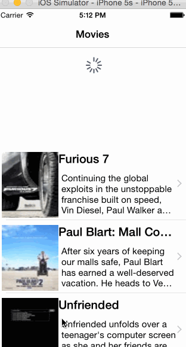

## Rotten Tomatoes

This is a movies app displaying box office and top rental DVDs using the [Rotten Tomatoes API](http://developer.rottentomatoes.com/docs/read/JSON).

Time spent: `12`

### Features

#### Required

- [Y] User can view a list of movies. Poster images load asynchronously.
- [Y] User can view movie details by tapping on a cell.
- [Y] User sees loading state while waiting for the API.
- [Y] User sees error message when there is a network error: http://cl.ly/image/1l1L3M460c3C
- [Y] User can pull to refresh the movie list.

Walkthrough of all user stories:

GIF created with [LiceCap](http://www.cockos.com/licecap/).

Credits
---------
* [Rotten Tomatoes API](http://developer.rottentomatoes.com/docs/read/JSON)
* [AFNetworking](https://github.com/AFNetworking/AFNetworking)
* [SVProgressHUD](https://github.com/TransitApp/SVProgressHUD)